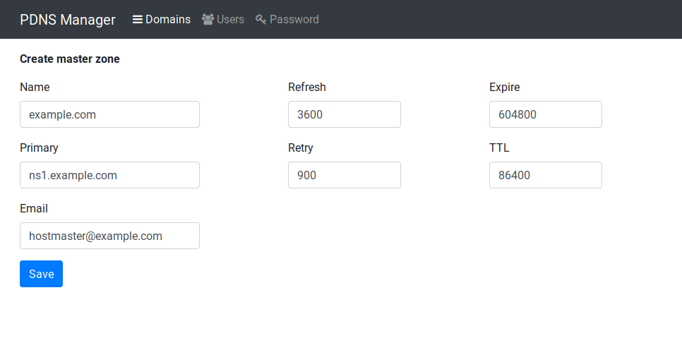
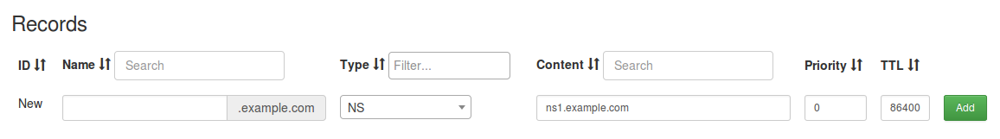
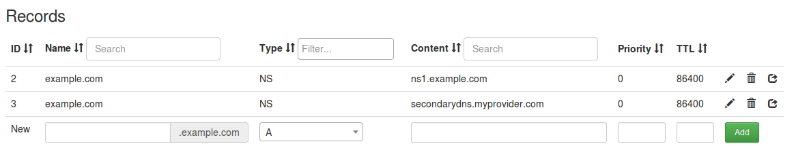

type: doc

## Add your first domain

This guide will lead you through the creation of your first domain and 
some basic records. To complete this tutorial you must be logged in as 
administrator to PDNS Manager.

### Add a new domain

In PDNS Manager, go to *Domains*. Press the button *Add*.

Insert your domain name, as well as the primary name server which is 
most likely a full qualified domain name of your server. Also add the 
email address of the administrator of this zone.

You can leave the remaining values at default.

Then press *Add* to confirm the changes. Afterwards you get redirected 
to the detail view of the domain.

### Add records for your name servers

For a complete zone you need at least NS records for the name servers 
authoritative for your zone. For second level domains most registrars 
require you to supply 2 name servers.

To configure a NS record for the domain, leave the *Name* field blank
as PDNS Manager will automatically append the master zone name to it.
Set the type to *NS* and enter the name servers FQDN in the *Content*
field.

Do the same for the second, and if applicable more, NS records. The 
result should look like the following, but obviously with your data.

Now your zone should be ready and you can add arbitrary records to it.
