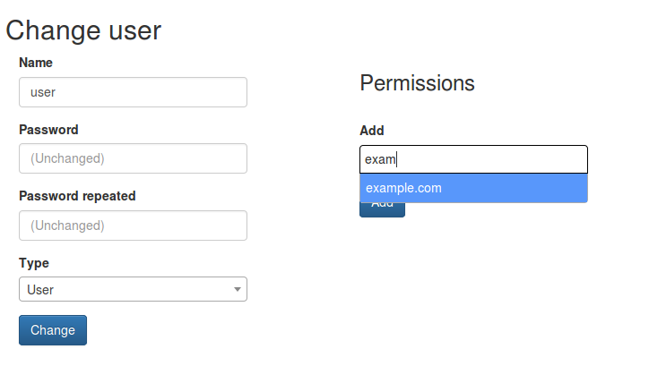
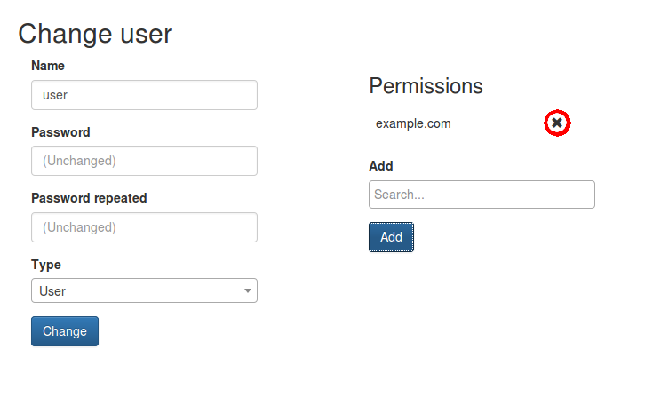

type: doc

## Users

PDNS manager has a very basic concept of users. With two permission 
levels.

* Administrator: An administrator can view and edit all domains and 
records. He is also able to add and edit users including their 
permissions. An administrator is the only one who is able to create new 
zones.
* User: A user can only view and modify domains they were assigned to by
an administrator.

### Add a user

To add a user you must, obviously, be logged in as administrator. 

Then click in the main menu on *Users* and click the *Add* button.

Enter a username and password and repeate the latter. Finaly you can 
chose whether the new user has administrative privileges or is a 
ordinary user.

Confirm your inputs and click *Add*. You get redirected to the edit 
page for the new user. Here you can make your edits as described in the 
next paragraph.

### Edit a user

To edit an existing user glick on *Users* in the main menu bar. Click 
on the user you want to edit.

In the following dialog you can change basic data of the user such as 
username, passsword and type of the account. This should be self 
self-explanatory.

#### Add permissions

To add permission for a new domain to the user begin to type the name 
of the domain you wish to add into the searchfield in the permissions 
area. You will get a selection with all domains matching your search 
and currently not assigned to the user. Click on the one you want to 
add. If you want you can repeat that step for more domains.

Finaly press *Add* and your selection will be stored.

#### Remove permissions

To remove a permission for a domain from the user simply click on the 
*X* symbol next to the domain name and the permission gets removed.

