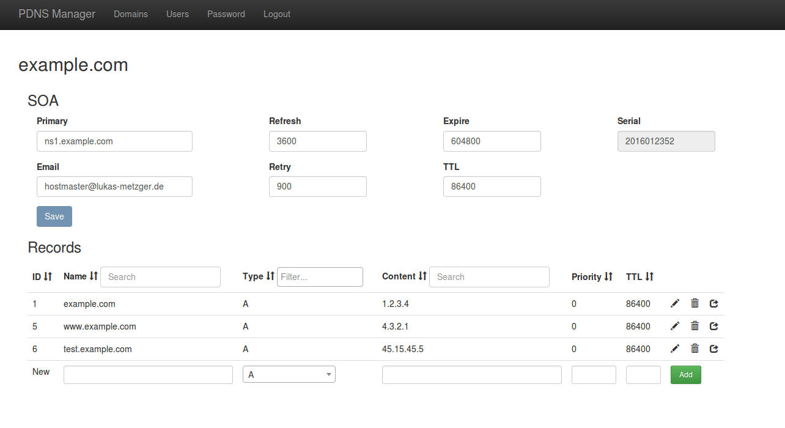

template: full.html

## Welcome to PDNS Manager

PDNS Manager is a simple yet powerful administration tool for the
Powerdns authoritative nameserver. It supports master, native and slave zones.

PDNS Manager was developed from scratch to achieve a user-friendly
and pretty looking interface.

PDNS Manager also features a powerful API to set records programmatically.
This can be used not only for a dynamic DNS service but also to obtain certificates
from [Let's Encrypt](https://letsencrypt.org/) via the dns-01 challenge.

The Backend of PDNS Manager is written in PHP using Slimphp. The backend uses a MySQL or Maria DB
database. The database is used by Powerdns through the pdns-backend-mysql. The Frontend is
developed using Angular and Bootstrap.

### Download the current Version of PDNS Manager

[<button class="btn btn-success">Download</button>](download.md)

### Upgrading from version 1.x

As PDNS Manager 2.0 is a complete rewrite, there are some steps required
to upgrade an existing installation to version 2.0. See [Upgrading from version 1.x](documentation/upgrading-v1.md).

### Features

* Full support for master, slave and native zones
* Flexible plugin interface for authentication and session storage
* Simple interface for SOA record management
* Multi user capability and permission management
* Support for all valid DNS record types
* Powerful API for various applications
* Completely documented API between frontend and backend
* Licensed under Apache 2.0

---

