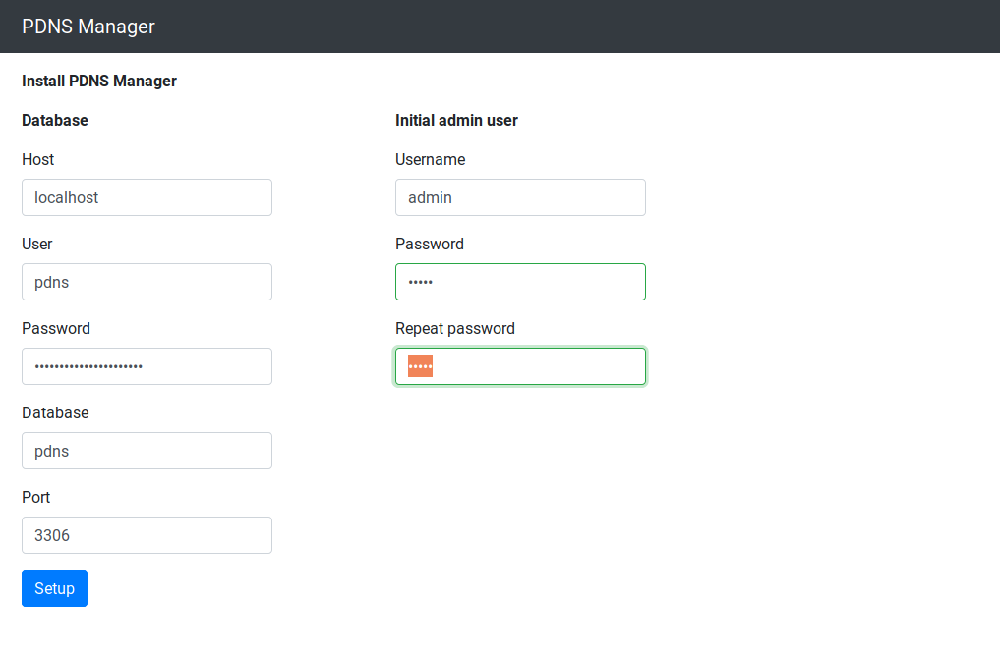

type: doc

## Getting started

This page guides you through the installation of PDNS Manager and
Powerdns as an authoritative nameserver on a Debian system. For other
systems you may have to adjust some steps.

### Prerequisites

In order to complete this tutorial, you must know how to:

1. Configure Apache or another PHP compatible
Webserver so that it delivers a page from a specific document root for a
given hostname. The configuration of HTTPS for that hostname is not
required although highly recommended in order to protect your sensitive
data.

2. Configure a MySQL or Maria DB server and a new empty database 
on it, preferably with separate user credentials only for the DNS 
stuff.

3. Make shure that you have the *php5-mysqlnd* package installed:
```
sudo apt-get install php5-mysqlnd
```

### Install PDNS Manager

In order to install PDNS Manager, go to [Download](download.md) and get 
the latest stable version. Unpack the archive and put the content in a 
folder on your system. Configure your webserver to deliver those files 
on a hostname of your choice.

In the following steps I assume that the hostname is
"https://pdns.example.com".

To start the installation, open a browser and navigate to 
"https://pdns.example.com/install.php".



Here you have to supply the database credentials:

* Host
* Username
* Password
* Database name
* Port

You have to provide a username and password for the first administrative user
of PDNS Manager.

After you have completed all necessary steps, press **Install**.
When the installation finished, you will be redirected to the login page where
you can now log in using the username and password you provided earlier.

### Install and configure Powerdns

Install Powerdns and the MySQL backend from the package sources:
```bash
sudo apt-get install pdns-server pdns-backend-mysql
```

Afterwards open */etc/powerdns/pdns.conf* with an editor of your choice 
and enter the following:
```
allow-axfr-ips=127.0.0.1 <ip of your secondary nameserver> 
allow-recursion=127.0.0.1
config-dir=/etc/powerdns
daemon=yes
disable-axfr=no
guardian=yes
local-address=0.0.0.0
local-port=53
master=yes
module-dir=/usr/lib/x86_64-linux-gnu/pdns
setgid=pdns
setuid=pdns
socket-dir=/var/run
version-string=powerdns
include-dir=/etc/powerdns/pdns.d
```

Replace &lt;ip of your secondary nameserver&gt; with the ip of your 
secondary nameserver if it will get its data via AXFR, otherwise just 
leave it out.

Now you have to supply the configuration for the MySQL backend. 
Open */etc/powerdns/pdns.d/pdns.local.gmysql.conf* with an editor of
your choice and configure it as follows:

```
launch=gmysql

gmysql-host=localhost
gmysql-port=3306
gmysql-dbname=pdns
gmysql-user=pdns
gmysql-password=pdns
gmysql-dnssec=no

```
Replace the parameters with those matching your setup.

You can now restart powerdns and it should be up and running.
```
sudo service pdns restart 
```

Have fun with your new DNS Server.
